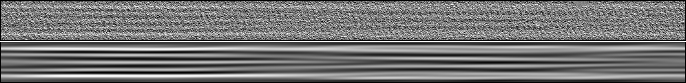

# cylindra-moire-analysis



A [cylindra](https://github.com/hanjinliu/cylindra) plugin for traditional moiré pattern analysis of microtubules.

This plugin was generated with [cookiecutter](https://github.com/cookiecutter/cookiecutter).

## Installation

```bash
pip install cylindra-moire-analysis
```

## Usage

After running spline fitting and global-CFT analysis, you can analyze the moiré patterns for each splines.

1. Automatic skew angle measurement.
    From "Plugins > Moire pattern analysis > Measure skew ...", the traditional skew angle will be automatically determined from the moiré pattern, printed in the logger and stored as `"moire_skew_angle"` global property of each spline.

2. Export images for [TubuleJ](https://igdr.univ-rennes.fr/en/node/3536) analysis.
    From "Plugins > Moire pattern analysis > Export for TubuleJ ...", the straightened and filtered images along with the calibration file will be exported. The exported directory can be directly opened in TubuleJ for further manual analysis.
